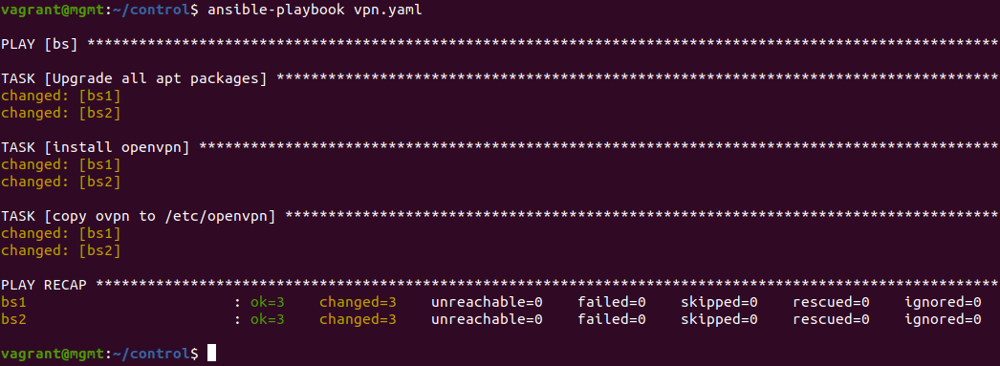
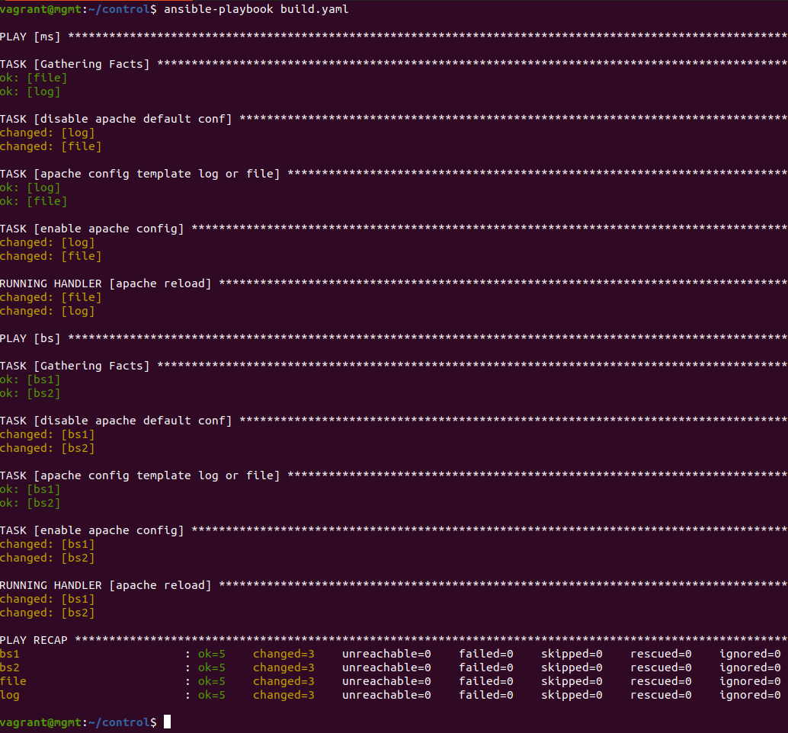

# Infrastructure

This is the setup guide for the correct deployment
of the infrastructure necessary for this project.
We are using **Ubuntu 20.04 LTS Focal Fossa**, however this should work in most Unix distributions.

## Directory Structure

First, confirm the directory has the following top level
structure:<br>

```
.
├── backupserver1
├── backupserver2
├── client
├── control
├── fileserver
├── logserver
├── provisioning
├── Vagrantfile

```

### Install vagrant (and plugins) and virtualbox

Second, confirm you have installed vagrant
and virtualbox. We used the following versions:<br>

##### - Vagrant 2.2.6<br>

##### - 6.1.10_Ubuntur138449 VBOX<br>

#### Install vagrant plugin

`vagrant plugin install vagrant-vbguest`<br>

### Checking the environment

Third, confirm that when running the command
`vagrant status` in the project directory
that the output is as such:


## Setting up the environment

### Creating Virtual Machines

First, run the command `vagrant up` as this will
start to create the VM's and provision them according
to their provision script.
This will take a couple of minutes (approx. 15).
It will create the following VMs:

- `mgmt`: This VM is not part of the service, seeing as
  its sole purpose is to be the Management Node. It's from
  this VM, in the guest's `control` directory, that the ansible scripts will be run which,
  in turn, will provide the other VM's with most modules
  and configurations needed.
- `log`: This VM is where the _Logs Server_ will be configured.
  It is provisioned by the script `bootstrap-logserver.sh`
  and it has configured a shared folder from the host's `logserver`
  directory to the guest's `/var/repo/logserver` with permissions
  and ownership necessary for _apache2_.

- `file`: This VM is where the _Files Server_ will be configured.
  It is provisioned by the script `bootstrap-fileserver.sh`
  and it has configured a shared folder from the host's `fileserver`
  directory to the guest's `/var/repo/fileserver` with permissions
  and ownership necessary for _apache2_.

- `bs1/bs2`: These VMs are where the _Backup Servers_ will be configured.
  They are provisioned by the script `bootstrap-backups.sh`
  and they have configured a shared folder from the host's `backupserver1`
  and `backupserver2`, depending on if _bs1_ or _bs2_,
  directory to the guest's `/var/repo/backupserver`
  with permissions and ownership necessary for _apache2_.

- `client1/client2`: These VMs are where the _Clients_ will be configured.
  They are provisioned by the script `bootstrap-client.sh`
  and they have configured a shared folder from the host's `client`
  directory to the guest's `/home/vagrant/client`.

### Ansible in Management node

After the `vagrant up` command is finished all
VMs should be running like such when running `vagrant status`:


Confirm your _control_ directory has been populated
with the following files:

- `bs1/bs2 .ovpn`: files necessary for the vpn connection afterwards.
  These were obtained by utilizing a third-party script found in
  [Nyr/openvpn-install](https://github.com/Nyr/openvpn-install)
  just with a line commented out in order to pass input non-interactively.
- `id_rsa/ id_rsa.pub`: keys for the ansible ssh password less setup.
- `rootCA.crt / rootCA.key`: certificate and key for our abstract CA:

Next you need to ssh into the Management Node by doing
`vagrant ssh mgmt`. Change directory into the control shared
folder and start by testing the basic ansible check command
which is `ansible all -m ping`. The response should be
the following:


#### Important first Steps

##### Password-less connection ssh

While most the steps are automated in our main playbook
**all_playbooks.yaml**, some steps have to be run first
otherwise some errors can occur.

First playbook to run has to be _ssh-addkey.yaml_ with
the option _--ask-pass_ which will then prompt for a password,
being the default password that
was used **vagrant**. Run the command
`ansible-playbook ssh-addkey.yaml --ask-pass`.
The output should be the following:


##### Configure VPN between _Files Server_ and _Backup Servers_

After, the next playbook that has to be run
is the _vpn.yaml_ with the command
`ansible-playbook vpn.yaml`. This will install openvpn
and insert and config vpn files in the _Backup Servers_.



Now it is needed to ssh into both _Backup Servers_ by
doing `vagrant ssh bs1` and `vagrant ssh bs2`. Here 2
commands have to be run in order to configure the vpn.
Here is the example for _bs1_ (for _bs2_ simply change the number
1 in each command):

- `sudo openvpn --client --config /etc/openvpn/bs1.conf`: You can
  quit the command when this state is reached:


- `sudo systemctl start openvpn@bs1`: After this
  by running the command `ip addr show` you can verify
  the following interface exists:


##### Playbook for module installment

Next the playbook _install.yaml_ will install
python modules and libraries as well apache2 (and
its dependencies) for the _Log/File/Backup Servers_.
It will also install python module and pip3 in the client
machines. Run the command
`ansible-playbook install.yaml`
which will take some time to finish (approx 3-4 min.):


Afterwards it is needed to ssh into _client1_ and _client2_
with `vagrant ssh client1` and `vagrant ssh client2`.
There install the python libraries needed with
`pip3 install -r client/requirements.txt`. This has
to be done this way, or an error will occur in another
playbook task.

Confirm if _cacert.pem_ exists in folder
`/home/vagrant/.local/lib/python3.6/site-packages/certifi/`
as such:


##### Last Ansible Step

To conclude, the final playbook has to be run
with the command `ansible-playbook all_playbooks.yaml`.
This will run 5 playbooks in total, which will take some time:

- `add_ca.yaml`: This will install a certificate module
  and update said module with our abstract CA certificate.
- `nfs.yaml`: This will setup a nfs server in the _Files Server_,
  export a "mountable" directory for the _Backup Servers_. It
  will also create _symlinks_ from this "mountable" directory
  to _/var/repo/fileserver/ and to _/var/repo/backupserver*, in
  the *Files Server* and *Backup Servers respectively. This will fail
  if the _sharedfiles_ link exists so make sure to delete it in all
  three servers before running. If it is forgotten then remove the _sharedfiles_
  and rerun the play _all_plpaybooks.yaml_.
- `generate-keys.yaml`: This will create keys and a certificate
  signed by our abstract CA in each of the **Servers**.
- `dist-crt.yaml`: This will add the abstract CA certificate
  to the _cacert.pem_ in all VMs.
- `build.yaml`: This will copy the apache2 configuration files
  and routing to each of the **Servers**.

The output should be similar to the following:


### Setting up database and Launching the Server

For this first step go to each server's folder
(ex: /var/repo/logserver for _Logs Server_) in the
guest's machines and run the following commands
(with an example output for the _Logs Server_:

- `sudo python3 manage.py makemigrations api`


- `sudo python3 manage.py migrate`


Finally, either run the command
`sudo systemctl restart apache2` in each of the
**Servers** or re-run the play _build.yaml_ in the
Management Node with `ansible-playbook build.yaml` (recommended).



If everything performed correctly then the infrastructure
has been provided.

# THE END
