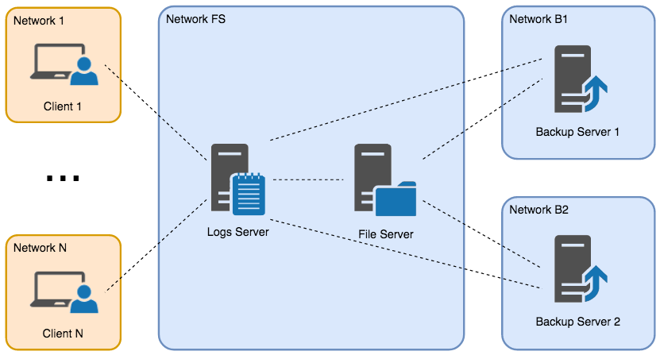
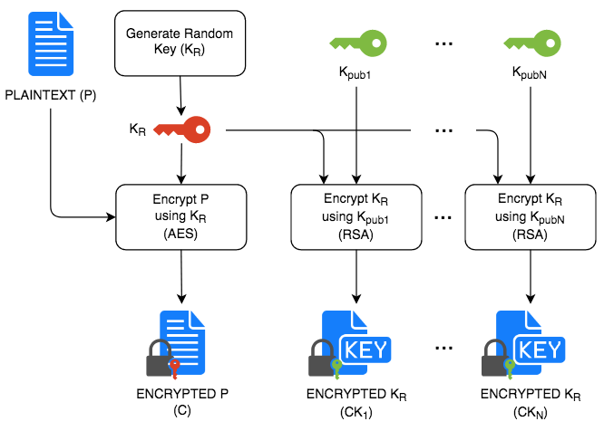
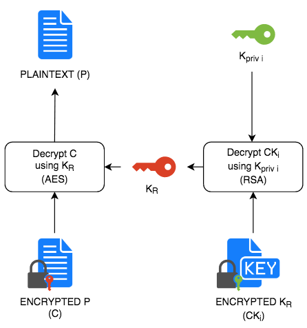

# Ransomware-resistant remote documents

## Scenario

Collaborative applications allow groups of users to create and edit documents remotely. These documents are regularly synchronized between personal devices and the remote servers. In these applications, a user, owner of the document, can select contributors which have access to the document. Documents should not be accessed by unauthorized parties. If an attacker accesses the servers storing the documents he must not be able to view the documents and if he tries to edit any document, there must be a way to detect the illegal modifications.

A ransomware attack happens when a system is breached and the attacker encrypts the user files and asks for a ransom to provide the decryption key. If properly implemented, recovering the files without the decryption key is an intractable problem. Also, the identification of the attackers can be difficult with the use of cryptocurrencies like BitCoin.
Organizations must have backups, with version history, to allow recovery in the case of ransomware attacks.

In this topic, the solution should allow documents to be shared over a public network in a secure fashion. It should allow authenticated users to access local and remote files in a transparent way. Data confidentiality must be assured even in the case where an attacker gains physical access to the data storage devices. Illegal modification of the documents by unauthorized users must be detected. The document system should resist ransomware attacks.

## 1. Identified Problem

The given scenario depends heavily on the reliable communication between a central server and a set of client machines, and thus suffers from the possibility of attacks to this channel, such as spoofing, replay, man-in-the-middle, and others.

Another worry to take into account is the threat of ransomware, since the main server will function as a storage for potentially shared files and documents, susceptible to malicious code. This code can propagate through the network and encrypt the files of users and servers, offering the key for decryption for a hefty amount, usually through the use of cryptocurrency such as Bitcoin.

Finally, there is also the possibility of a physical attack to the servers, where an intruder (attacker) might access the data servers and attempt to read or modify a document to which he has no permissions.

These are considered to be the three main points where security problems may arise and where security mechanisms will need to be implemented in order to guarantee a secure environment. Additionally, in this manner, not only is the risk of an attack minimized, but also the impact and damage of a successful one mitigated through the recovery of documents.

### 1.1. Requirements

- Authenticity, Integrity, Confidentiality and Freshness in communications between all parties;
- Client side file encryption for storage confidentiality;
- Detection and recovery from integrity and ransomware attacks to the shared documents;

### 1.2. Trust Assumptions

- We won't trust users if they don’t have the correct permissions for a specified document or whose requests don’t assure authenticity, integrity, confidentiality and freshness;
- We won’t trust anyone with physical access to file servers in terms of both read and write access;
- We will trust that the servers won’t become unavailable, due to malfunction or denial of service;
- We will trust that there will be no malicious physical access to the Logs Server;
- We will trust that there will be no malicious physical access to more than one file storing server at
  once. This includes the main File Server and the Backup Servers;

## 2. Proposed Solution

### 2.1. Overview

We will implement the file sharing system ourselves. The Django REST Framework python package will be used for realizing the database, application server-side and client-side, and for the communications between machines. TLS will be used in all these communications. The application itself to synchronize files between parties will also be developed by ourselves.

The solution will follow the diagram presented below (Fig.1) in terms of structure and communication between machines:

The File Server files will be stored encrypted. The encryption will be made by the Client Group that has access to the file, using a Group version of the PGP protocol (GPGP). To use the system, clients will need to register themselves through the Logs Server.

We will protect the system from physical integrity attacks and ransomware using a custom made protocol, which we will call Ransomware and Integrity Recovery (RIR), that will work in two phases:

- Detection, where illegal changes to files are detected using a log system stored in the Logs Server;
- Recovery, that will use redundancy by having the infrastructure setup in a 3-2 system way:
  - 3 servers, 2 of them for backups online, all of them in different private networks;

### 2.2. Deployment

VirtualBox will be used to deploy each machine in the system as a VM:

- The File Server machine will store and manage all files;
- The Logs Server machine will act as the entryway to the FS network. It will be split into:
  - A user registry system;
  - A log system for every file update;
- The Backup Server 1 and 2 will serve as backup servers for the files in the File Server machine;
- Four Client machines that will connect to the main server:
  - Three Client machines accessing files, two of them sharing;
  - One Client machine performing attacks (communications and ransomware);

### 2.3. ​Secure channel(s) to configure

Communication between machines will be made using TLS (HTTPS). Communication paths are expressed in Fig.1 as dashed lines. As per the diagram, there will exist a certificate for all the machines (public and private keys), and since TLS will use AES, a symmetric key will be generated and used for each communication session.

### 2.4. ​Secure protocol(s) to develop

Both GPGP and RIR will be developed in Python. Each Client will have a pair of RSA keys. The public keys will be stored at the logs server upon registration over TLS to be used for GPGP (not at File Server since an attacker can access it physically).

### 2.4.1. GPGP Protocol

- Used to encrypt files, so they can be confidentially stored at the File Server;
- Used to decrypt files that a client has access to;
- Files are sent using TLS;

#### Protocol Specification

The following two diagrams specify how the GPGP protocol will work at the client-side for encrypting and decrypting files, being N the number of clients that share file P:

### 2.4.3. RRP Protocol

- Used to detect data integrity attacks to the files at the File Server, by using a log system;
- Used to recover from data integrity and ransomware attacks by use of redundancy, using backups (3-2 rule);
- Communications use TLS;

#### Protocol Specification

The diagram that follows and its legend specifies how the RIR protocol will be able to verify storage integrity in the File Server. The described scenario supposes the client is already registered and logged in to the file system.

1. Client 1 updates file P and sends:
   a. C and CK1​ (GPGP);
   b. V = Version number;
   c. S = E-RSA(H-SHA(C + CK1 + V), Kpriv)​, where S is the signature and K​priv​ Client 1’s private RSA key;
2. Logs Server (LS) stores V and S in its database;
3. LS redirects C and CK​1​ to the File Server (FS) for storage;
4. FS stores C and CK1​ ​ in its database;
5. An Integrity Check request is started by the FS to the Backup Servers (one in this case, BS1);
6. BS1 gets the latest update logs from the LS. The LS sends:
   a. V;
   b. D = D-RSA(S, K​pub)​, where D is the digest for this specific log and K​pub​ Client 1’s public RSA key;
7. BS1 gets the latest files from the FS, that sends:
   a. C and CK1​ ;
8. BS1, in possession of C, CK​1​, V and D, checks for the integrity of the files:
   a. D’ = HSHA(​C + CK​1​ + V);
   b. If D’ != D, then there was malicious tampering with the file in the FS;
   c. Else if VB ​> V, where V​B​ is the version number stored at BS1, then there was tempering with the BS1’s files;

In this example, it is worth noting:

- 1.b.: V is an incremental number that starts at 1 and increases for each update on file P;
- 6.b.: D is sent instead of S because clients public keys cannot be sent to physically untrusted servers, and D, being needed, is only obtainable using Kp​ ub​;
- 8.c.: The tempering is at the BS1 and not at the FS because V is protected at the LS. This means that a rollback attack to the FS files would be detected in the D’ != D check.

The RIR protocol recovery phase is accomplished by:

- Deploying the file system stored at BU1 in FS and restoring versions in LS for case 8.b.;
- Backing up from FS for case 8.c.;

## 3. Plan

### 3.1. Versions

- **Basic**​ - Setup infrastructure and add secure communication between machines, configuring TLS for all communications. Basic PGP implementation for file encryption, but without sharing functionality.
- **Intermediate**​ - Add RIR protocol for integrity and ransomware detection and recovery.
- **Advanced**​ - Add GPGP protocol at client side to enable file sharing between clients.

### 3.1. Effort Commitments

| Semanas       | Manuel Mascarenhas          | Miguel Levezinho            | Ricardo Fernandes               |
| :------------ | :-------------------------- | :-------------------------- | :------------------------------ |
| Nov 02-08     | Custom Protocol Design      | Custom Protocol Design      | Custom Protocol Design          |
| Nov 09-15     | Django System Configuration | Django System Configuration | Django System Configuration     |
| Nov 16-22     | Configure Infrastructure    | Configure Infrastructure    | Django System Configuration     |
| Nov 23-29     | Implement PGP protocol      | Implement PGP protocol      | Configure TLS for communication |
| Nov/Dec 30-06 | Implement RIR protocol      | Implement RIR protocol      | Implement RIR protocol          |
| Dec 07-12     | Implement GPGP protocol     | Implement GPGP protocol     | Implement GPGP protocol         |

## 4. References

[Django](https://www.djangoproject.com/)
<b>
[Django REST Framework](https://www.django-rest-framework.org/)
<b>
[PGP](https://en.wikipedia.org/wiki/Pretty_Good_Privacy)
<b>
[Data Integrity in storage](https://www.fsl.cs.sunysb.edu/docs/integrity-storagess05/integrity.html)
<b>
[3-2-1 Backup Strategy for ransomware](https://www.titanhq.com/blog/ransomware-protection-why-the-3-2-1-backup-strategy-works/)
