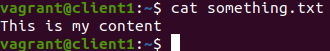
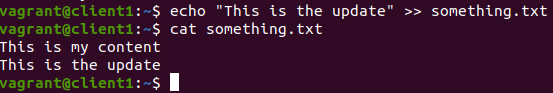
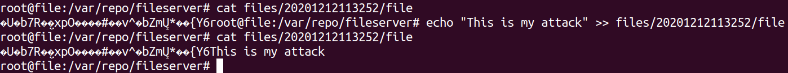
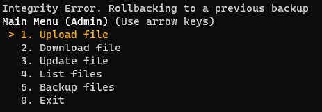

## Requesting Backup detects Intrusion

This can be done with one only one _Client_
or with two _Clients_. One client makes it so
you have to keep repeating the login.

### Setup

1. Create a file named _something.txt_ with some content inside.
   
2. [Upload the file _something.txt_](../client/upload.md)
3. Exit client
4. [Order a Backup](../client/backup.md) and Exit
5. Change the content of _something.txt_
   
6. Login as the user that uploaded _something.txt_
7. [Update the file _something.txt_](../client/update.md) and Exit

### Attack

For this attack you will simulate the physical intrusion
into the _Files Server_.

1. In another terminal ssh into the _Files Server_ by running
   `vagrant ssh file`. Change into the main directory at
   `/var/repo/fileserver`.

2. Here use alter the contents of the encryted file
   which is located in the directory
   `files/{somedate}/file` (it is the most recent date as it was
   the latest file created due to the upload by the client).
3. Introduce new content into the encrypted file, thus compromising
   its integrity.

### Return to the Client

1. [Order a Backup](../client/backup.md)
2. The message outputted should be the following  
   
   1. If so, the integrity attack was detected and the servers reverted to the previous backup.
