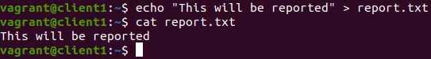
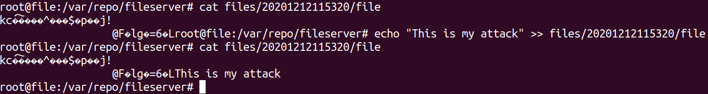
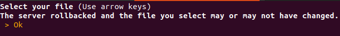

## Client detects Intrusion and Reports it

This can be done with one only one _Client_
or with two _Clients_. One client makes it so
you have to keep repeating the login.

### Setup

1. Run the client `python3 client/main.py`
2. [Register](../client/register.md) or [login](../client/login.md)
3. Create a file named _report.txt_ with some content inside.
   
4. [Upload the file _report.txt_](../client/upload.md)
5. Exit
6. [Order a Backup](../client/admin_backup.md) and Exit

### Attack

For this attack you will simulate the physical intrusion
into the _Files Server_.

1. In another terminal ssh into the _Files Server_ by running
   `vagrant ssh file`. Change into the main directory at
   `/var/repo/fileserver`.

2. Here use alter the contents of the encryted file
   which is located in the directory
   `files/{somedate}/file`(it is the most recent date as it was
   the latest file created due to the upload by the client).

3. Introduce new content into the encrypted file, thus compromising
   its integrity.

### Return to the client

1. [Login](../client/login.md) as the client who created and uploaded _report.txt_
2. [Download the file _report.txt_](../client/download.md)

The client will detect the compromised file and report it to
the _Logs Server_. The _Logs Server_ will confirm the compromised
integrity and revert to the previous backup.
