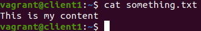
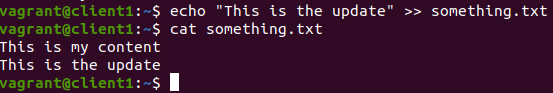
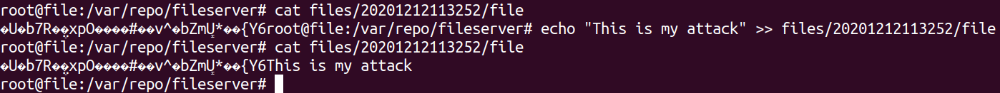
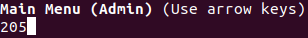

## Requesting Backup detects Intrusion

This can be done with one only one *Client*
or with two *Clients*. One client makes it so
you have to keep repeating the login.

### Setup

1. Run the client `python3 client/main.py`
2. [Register](../register.md) or [login](../login.md)
3. Create a file named *something.txt* with some content inside.

4. [Upload the file *something.txt*](../upload.md) and Exit Menu
5. [Login as Admin](../login_admin.md)
6. [Order a Backup](../admin_backup.md) and Exit
7. Change the content of *something.txt*

8. Login as the user that uploaded *something.txt*
9. [Update the file *something.txt*](../update.md) and Exit

### Attack

For this attack you will simulate the physical intrusion
into the *Files Server*.

1. In another terminal ssh into the *Files Server* by running
`vagrant ssh file`. Change into the main directory at
`/var/repo/fileserver`.

2. Here use alter the contents of the encryted file 
which is located in the directory 
`files/{somedate}/file`(it is the most recent date as it was
the latest file created due to the upload by the client).
   
3. Introduce new content into the encrypted file, thus compromising
its integrity.
   

### Return to the Client
   
1. Login as admin
2. Order a Backup and verify code 205 is returned and Exit

   
If 205 is returned then the server detected the intrusion
and reverted to the previous backup.

