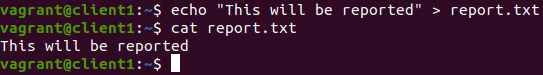
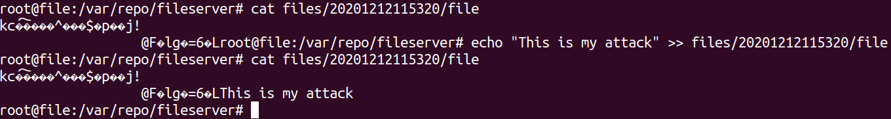
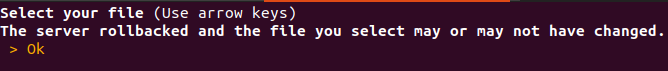

## Client detects Intrusion and Reports it

This can be done with one only one *Client*
or with two *Clients*. One client makes it so
you have to keep repeating the login.

### Setup

1. Run the client `python3 client/main.py`
2. [Register](../register.md) or [login](../login.md)
3. Create a file named *report.txt* with some content inside.
   
4. [Upload the file *report.txt*](../upload.md) and Exit Menu
5. [Login as Admin](../login_admin.md)
6. [Order a Backup](../admin_backup.md) and Exit

### Attack

For this attack you will simulate the physical intrusion
into the *Files Server*.

1. In another terminal ssh into the *Files Server* by running
   `vagrant ssh file`. Change into the main directory at
   `/var/repo/fileserver`.

2. Here use alter the contents of the encryted file
   which is located in the directory
   `files/{somedate}/file`(it is the most recent date as it was
   the latest file created due to the upload by the client).

3. Introduce new content into the encrypted file, thus compromising
   its integrity.
   

   
### Return to the client

1. Login as client that created and uploaded *report.txt*
2. [Download the file *report.txt*](../download.md)

The client will detect the compromised file and report it to
the *Logs Server*. The *Logs Server* will confirm the compromised
integrity and revert to the previous backup.