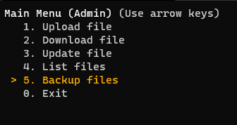

## Backup files

1. [Register a admin user](./admin.md) if you never did
2. Run the client `python3 client/main.py`
3. [login](./login.md) with the admin credentials (when it asks you for a private key insert any valid one path)
4. Select the **Backup files** option  
   
5. Check the message received
