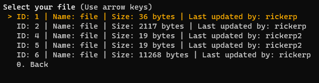

## Download a file

1. Run the client `python3 client/main.py`
2. [Register](./register.md) or [login](./login.md)
3. You must have access to a file already uploaded to the server. If not, you must [upload one](./upload.md)
4. Select the **Download file** option  
   
5. Choose which file you want to download  
   
6. Enter the path of the file located in your computer
7. Your file was downloaded in the selected path

### Back to [CLIENT.md](../CLIENT.md)
