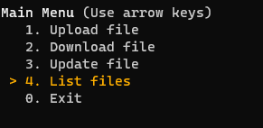

## List files

1. Run the client `python3 client/main.py`
2. [Register](./register.md) or [login](./login.md)
3. Select the **List files** option  
   
4. The files which you have access have been listed
