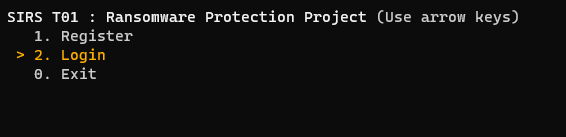
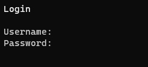

## Login

1. Run the client `python3 client/main.py`
2. Select **Login**  
   
3. Select the path of the private RSA key used when registered
4. Enter your username and password  
   
5. Done! You are now logged in.
