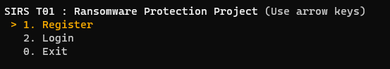
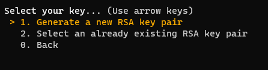
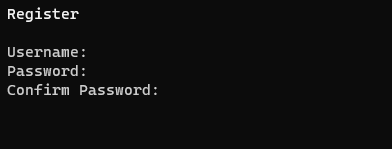

## Register

1. Run the `python3 client/main.py`
2. Select **Register**  
   
3. Choose whether to register with a new generate RSA pair of keys or select an already existent one  
   
   1. Generate a new key pair
      - Choose where to save the private key, don't delete or forget about it.
      - If you loose this key you can't decrypt your stored files
   2. Select an already existing pair o RSA keys
      - You can use a RSA pair that was previously generated
      - Specify the private key path
4. Enter your username and password
   
5. Done! You are now registered and also logged in.
