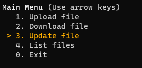
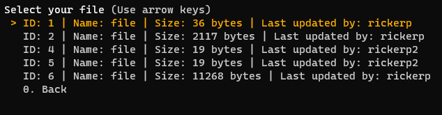
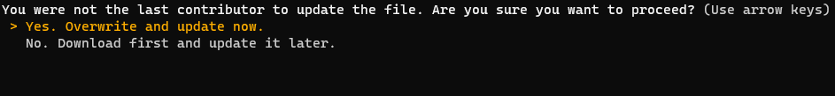

## Update a file

1. Run the client `python3 client/main.py`
2. [Register](./register.md) or [login](./login.md)
3. You must have access to a file already uploaded to the server. If not, you must [upload one](./upload.md)
4. Select the **Update file** option  
   
5. Choose which file you want to update
   

   1. If the file is shared, and you were not the last contributor to update it, you will get the following warning  
      
      - Choose **Yes**, if you already downloaded the most recent version of the file and you want to update it
      - Choose **No** , if you want to download the most recent version of the file

6. Enter the file in question path
7. Your file was updated
