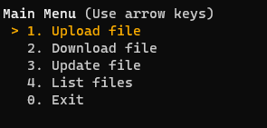
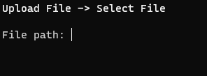
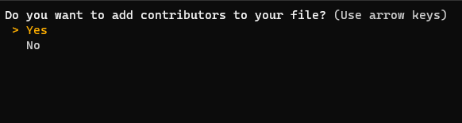

## Upload a file

1. Run the client `python3 client/main.py`
2. [Register](./register.md) or [login](./login.md)
3. Select the **Upload file** option  
   
4. Enter the path of the file to be uploaded  
   
5. Choose whether or not you want to add contributors to your file  
   
   1. Yes
      - Enter the usernames of the contributors each followed by a _Enter_
      - When finished enter a empty username
6. Your file was uploaded
